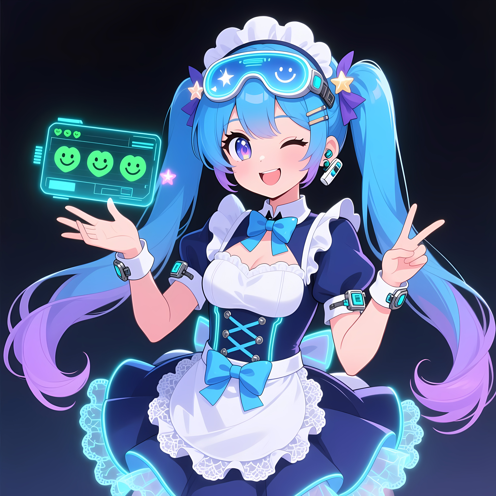

<div align="center">
  </img>
  <br>
  <span style="color: gray; font-size: small;">图标由AI生成</span>
  <h1>AI-Shikikan</h1>
</div>

<h4 align="center">一个使用 .NET 10 C# 开发的 Agent 指挥官</h4>

<p align="center">
  
  
  
  
</p>

---

## 它是什么

AI-Shikikan 是一款可以将多个终端 Agent 集合在一起，并让 AI 统一指挥调度这些 Agent 的图形程序。

你可以把它理解为：**一个 AI 指挥官，能调度 Claude Code、OpenCode、DeepSeek Harness 等工具协同完成复杂任务。**

```
用户请求 → AI指挥官 → 分析任务 → 调用子Agent → 汇总结果 → 返回用户
                ↑
        人格/专家注入
```

## 功能

- **多 Agent 调度**：让 AI 调用主流 Agent 程序（Claude Code、OpenCode、DeepSeek Harness、Codex CLI、Gemini CLI）
- **可配置模型**：为不同 Agent 使用不同的模型完成对应任务
- **人格/专家注入**：对指挥官自身/Agent 程序注入角色扮演或专家文件
- **Git 步骤管理**：自动创建步骤分支，支持回滚与合并
- **Git 检查点**：每条用户消息自动记录检查点，支持 Commit/tag 标记、回滚与派生
- **会话分支绑定**：每个会话绑定独立分支，支持同分支并发操作

## 支持的 LLM API

- **OpenAI Style**：OpenAI、Azure OpenAI、DeepSeek 等兼容接口
- **Anthropic Style**：Anthropic Claude 原生接口

## 快速开始

### 构建

```bash
# 构建所有平台
./build.sh all

# 仅构建 Linux
./build.sh linux

# 仅构建 ARM64
ARCH=arm64 ./build.sh linux

# 不使用 AOT
AOT_MODE=off ./build.sh linux
```

### 运行

```bash
# 启动图形界面
./AIShikikan.Gui

# 查看版本
./AIShikikan.Gui --version

# 诊断环境
./AIShikikan.Gui doctor
```

## 配置

配置文件存放在用户目录：

| 平台 | 配置目录 |
|------|----------|
| Linux | `~/.config/ai-shikikan/` |
| macOS | `~/Library/Application Support/AI-Shikikan/Config/` |
| Windows | `%APPDATA%\AI-Shikikan\Config\` |

### 核心配置文件

| 文件 | 说明 |
|------|------|
| `providers.toml` | LLM Provider 配置（API Key、模型、端点） |
| `agents.toml` | Agent 定义（可执行文件、参数、专长） |
| `personas/` | 人格/专家 Markdown(YAML frontmatter) 文件目录 |
| `templates/` | 任务模板 TOML 文件目录 |
| `roster.prompt` | Roster 注入模板 |

### 示例配置

参考 `templates/config/` 目录中的示例文件。

**providers.toml 示例：**
```toml
active_provider_id = "anthropic"

[[providers]]
id = "anthropic"
name = "Anthropic"
kind = "Anthropic"
base_url = "https://api.anthropic.com"
api_key = "sk-ant-..."
default_model = "claude-sonnet-4-20250514"
```

**agents.toml 示例：**
```toml
rules = "优先选择专长与任务匹配的 Agent"

[[agents]]
id = "claude"
name = "Claude Code"
executable = "claude"
args = ["-p", "{prompt}"]
description = "Anthropic 官方编码 Agent"
```

## 默认 Agent

首次启动会自动生成 `agents.toml`（含以下默认 Agent），可自由修改或删除；用户配置以文件为准，删除后不会恢复。

| Agent | 可执行文件 | 专长 |
|-------|-----------|------|
| Claude Code | `claude` | 编码、重构、测试 |
| Codex CLI | `codex` | 修复、小步修改、lint |
| Gemini CLI | `gemini` | 搜索、研究、多模态 |
| OpenCode | `opencode` | 通用、跨栈、脚本 |
| DeepSeek Harness | `dsh` | DeepSeek 官方 Harness、插件化运行时 |

## Git 检查点

每条用户消息自动记录检查点，支持 Commit/tag 标记与完整生命周期管理。

| 功能 | 说明 |
|------|------|
| Commit/tag 检查点 | 每条用户消息生成检查点，可标记 commit 或 tag |
| 每条消息检查点 | 消息发送即创建检查点，确保可回滚 |
| 非 Git 降级 | 未初始化 Git 时聊天仍可用，检查点/Git 写工具不可用 |
| 会话分支绑定 | 每个会话绑定独立分支，互不干扰 |
| 同分支并发 | 同一分支支持并发操作，检查点隔离 |
| Checkpoint 卡片 | 每条检查点支持 Reset（重置）、Revert（反向提交）、Fork（派生新分支） |

### 旧步骤迁移

从旧 `steps/*.json` 格式自动迁移至新检查点系统：

- 启动时自动扫描旧步骤记录，优先解析 MergeCommit，其次取 StepBranch tip
- 建立 `oldStepId → newCheckpointId` 映射，更新 assignments/sessions JSON 引用
- 迁移状态持久化防重复，部分成功不删除旧源文件
- 无法迁移返回结构化汇总，可重试
- 旧 `ac/*` 分支永不自动删除

## 架构

```
AIShikikan.Gui     - 图形界面 (Avalonia) + 核心逻辑
  ├── Core/                - 核心逻辑（AOT 兼容）
  │   ├── Services/Git     - Git 步骤管理 + 旧步骤迁移服务
  │   ├── Services/Engine    - Agent 调度引擎
  │   ├── Services/Agents    - Agent 定义与配置
  │   ├── Services/Llm       - LLM 客户端 (OpenAI/Anthropic)
  │   ├── Services/Personas  - 人格/专家管理
  │   ├── Services/Templates - 任务模板
  │   └── Services/Tools     - 内置工具集
  ├── ViewModels/          - MVVM 视图模型
  └── Views/               - Avalonia XAML 视图
```

## 鸣谢

### 库

- [Anthropic.SDK](https://www.nuget.org/packages/Anthropic.SDK/)
- [Azure.AI.OpenAI](https://www.nuget.org/packages/Azure.AI.OpenAI/)
- [Avalonia](https://www.nuget.org/packages/Avalonia/)
- [Avalonia.Desktop](https://www.nuget.org/packages/Avalonia.Desktop/)
- [AvaloniaUI.DiagnosticsSupport](https://www.nuget.org/packages/AvaloniaUI.DiagnosticsSupport/)
- [CCSWE.Avalonia.Material](https://www.nuget.org/packages/CCSWE.Avalonia.Material/)
- [CommunityToolkit.Mvvm](https://www.nuget.org/packages/CommunityToolkit.Mvvm/)
- [Material.Icons.Avalonia](https://www.nuget.org/packages/Material.Icons.Avalonia/)
- [ScottPlot.Avalonia](https://www.nuget.org/packages/ScottPlot.Avalonia/)
- [Tomlyn](https://www.nuget.org/packages/Tomlyn/)
- [YamlDotNet](https://www.nuget.org/packages/YamlDotNet/)

### 字体

- [HarmonyOS Sans SC](https://developer.huawei.com/consumer/cn/design/resource/) — 华为, 依据 *HarmonyOS Sans 字体许可协议* 使用(默认标准字体)
- [CaskaydiaCove Nerd Font Mono](https://github.com/ryanoasis/nerd-fonts) — Nerd Fonts 项目, 依据 *SIL Open Font License 1.1* 使用(默认等宽字体)

字体文件与许可文本位于 `src/AIShikikan.Gui/Assets/Fonts/`。

## 贡献者


